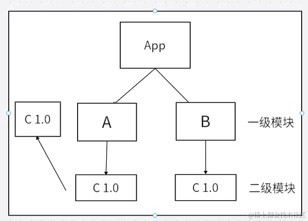
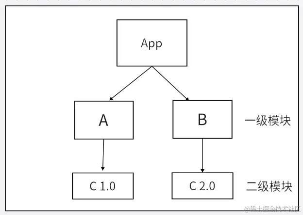
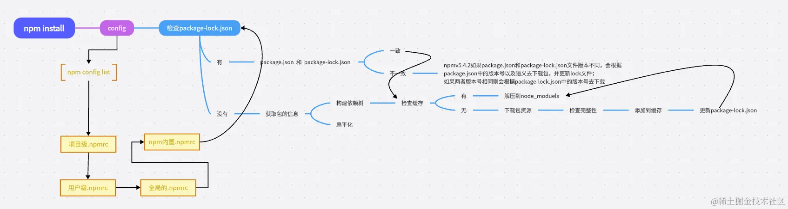

首先安装的依赖都会存放在根目录的node_modules,默认采用扁平化的方式安装，并且排序规则.bin第一个然后@系列，再然后按照首字母排序abcd等，并且使用的算法是广度优先遍历，在遍历依赖树时，npm会首先处理项目根目录下的依赖，然后逐层处理每个依赖包的依赖，直到所有依赖都被处理完毕。在处理每个依赖时，npm会检查该依赖的版本号是否符合依赖树中其他依赖的版本要求，如果不符合，则会尝试安装适合的版本

### 扁平化
扁平化只是理想状态如下


安装某个二级模块时，若发现第一层级有相同名称，相同版本的模块，便直接复用那个模块
因为A模块下的C模块被安装到了第一级，这使得B模块能够复用处在同一级下；且名称，版本，均相同的C模块
非理想状态下


因为B和A所要求的依赖模块不同，（B下要求是v2.0的C，A下要求是v1.0的C ）所以B不能像2中那样复用A下的C v1.0模块 所以如果这种情况还是会出现模块冗余的情况，他就会给B继续搞一层node_modules，就是非扁平化了。

### npm install 后续流程


.npmrc文件的可配置项：
```js
registry=http://registry.npmjs.org/
# 定义npm的registry，即npm的包下载源

proxy=http://proxy.example.com:8080/
# 定义npm的代理服务器，用于访问网络

https-proxy=http://proxy.example.com:8080/
# 定义npm的https代理服务器，用于访问网络

strict-ssl=true
# 是否在SSL证书验证错误时退出

cafile=/path/to/cafile.pem
# 定义自定义CA证书文件的路径

user-agent=npm/{npm-version} node/{node-version} {platform}
# 自定义请求头中的User-Agent

save=true
# 安装包时是否自动保存到package.json的dependencies中

save-dev=true
# 安装包时是否自动保存到package.json的devDependencies中

save-exact=true
# 安装包时是否精确保存版本号

engine-strict=true
# 是否在安装时检查依赖的node和npm版本是否符合要求

scripts-prepend-node-path=true
# 是否在运行脚本时自动将node的路径添加到PATH环境变量中

```

### package-lock.json 的作用
很多朋友只知道这个东西可以锁定版本记录依赖树详细信息

- version 该参数指定了当前包的版本号
- resolved 该参数指定了当前包的下载地址
- integrity 用于验证包的完整性
- dev 该参数指定了当前包是一个开发依赖包
- bin 该参数指定了当前包中可执行文件的路径和名称
- engines 该参数指定了当前包所依赖的Node.js版本范围

知识点来了，package-lock.json 帮我们做了缓存，他会通过 `name + version + integrity`信息生成一个唯一的key，这个key能找到对应的index-v5 下的缓存记录 也就是npm cache 文件夹下的文件

如果发现有缓存记录，就会找到tar包的hash值，然后将对应的二进制文件解压到node_modules
