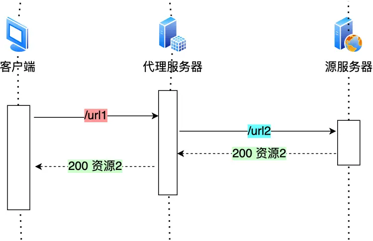

# 计网

## 输入网址到网页显示，期间发生了什么

浏览器解析 url--> 生成 HTTP 请求信息-->查询服务器域名对应的 IP 地址 -->查询 DNS 服务器-->解析域名-->获取目标 IP-->HTTP 传输交给协议栈-->HTTP 基于 TCP 协议传输-->三次握手建立连接-->IP 模块负责将 TCP 传递过来的数据封装成 IP 数据报，也称为网络包。这个过程称为封装或打包-->加上 MAC 头部(用于在物理网络中传输)组合成网络帧-->将组合后的网络帧发送给网络接口卡-->网络接口卡将网络帧转换为物理信号，并通过物理网络介质（如以太网电缆、无线信道等）传输到目标节点-->解封装：目标节点的网络接口卡会解封装网络帧，提取出包含 IP 数据报和 MAC 头部的信息。-->IP 数据报传递给 IP 模块：目标节点的网络接口卡将提取出的 IP 数据报传递给 IP 模块。-->IP 数据报解析：IP 模块解析 IP 数据报，提取出源 IP 地址和目标 IP 地址等信息。-->交给 tcp 处理数据-->交给应用层使用数据

> 首先浏览器做的第一步工作就是要对 `URL` 进行解析，从而生成发送给 `Web` 服务器的请求信息。

> 生产 HTTP 请求信息

> 通过浏览器解析 URL 并生成 HTTP 消息后，需要委托操作系统将消息发送给 `Web` 服务器。
>
> 但在发送之前，还有一项工作需要完成，那就是**查询服务器域名对应的 IP 地址**，因为委托操作系统发送消息时，必须提供通信对象的 IP 地址。

##### 域名的层级关系

DNS 中的域名都是用**句点**来分隔的，比如 `www.server.com`，这里的句点代表了不同层次之间的**界限**。

在域名中，**越靠右**的位置表示其层级**越高**。

实际上域名最后还有一个点，比如 `www.server.com.`，这个最后的一个点代表根域名。

也就是，`.` 根域是在最顶层，它的下一层就是 `.com` 顶级域，再下面是 `server.com`。

所以域名的层级关系类似一个树状结构：

- 根 DNS 服务器（.）
- 顶级域 DNS 服务器（.com）
- 权威 DNS 服务器（server.com）

> 域名解析的工作流程

1. 客户端向本地 DNS 服务器发 DNS 请求
2. 本地服务器 如果有缓存 则它直接返回`ip`地址，如果没有 本地 DNS 服务器会向根服务器发送请求询问
3. 根服务器再向顶级域服务器询问 顶级域再向权威 DNS 服务器发送请求
4. 权威 DNS 返回 IP 地址到**本地 DNS 服务器**
5. 本地 DNS 服务器再将 IP 地址返回客户端，客户端和目标建立连接

> 那是不是每次解析域名都要经过那么多的步骤呢？

当然不是了，还有缓存这个东西的嘛。

浏览器会先看自身有没有对这个域名的缓存，如果有，就直接返回，如果没有，就去问操作系统，操作系统也会去看自己的缓存，如果有，就直接返回，如果没有，再去 hosts 文件看，也没有，才会去问「本地 DNS 服务器」。

> 通过 DNS 获取到 IP 后，就可以把 HTTP 的传输工作交给操作系统中的**协议栈**。

应用程序（浏览器）通过调用 Socket 库，来委托协议栈工作。协议栈的上半部分有两块，分别是负责收发数据的 TCP 和 UDP 协议，这两个传输协议会接受应用层的委托执行收发数据的操作。

---

协议栈的下面一半是用 IP 协议控制网络包收发操作，在互联网上传数据时，数据会被切分成一块块的网络包，而将网络包发送给对方的操作就是由 IP 负责的。

此外 IP 中还包括 `ICMP` 协议和 `ARP` 协议。

- `ICMP` 用于告知网络包传送过程中产生的错误以及各种控制信息。
- `ARP` 用于根据 IP 地址查询相应的以太网 MAC 地址。

IP 下面的网卡驱动程序负责控制网卡硬件，而最下面的网卡则负责完成实际的收发操作，也就是对网线中的信号执行发送和接收操作。

> TCP 传输数据之前，要先三次握手建立连接

- 一开始，客户端和服务端都处于 `CLOSED` 状态。先是服务端主动监听某个端口，处于 `LISTEN` 状态。
- 然后客户端主动发起连接 `SYN`，之后处于 `SYN-SENT` 状态。
- 服务端收到发起的连接，返回 `SYN`，并且 `ACK` 客户端的 `SYN`，之后处于 `SYN-RCVD` 状态。
- 客户端收到服务端发送的 `SYN` 和 `ACK` 之后，发送对 `SYN` 确认的 `ACK`，之后处于 `ESTABLISHED` 状态，因为它一发一收成功了。
- 服务端收到 `ACK` 的 `ACK` 之后，处于 `ESTABLISHED` 状态，因为它也一发一收了。

所以三次握手目的是**保证双方都有发送和接收的能力**。

> TCP 分割数据

如果 HTTP 请求消息比较长，超过了 MSS 的长度，这时 TCP 就需要把 HTTP 的数据拆解成一块块的数据发送，而不是一次性发送所有数据。

MTU：一个网络包的最大长度，以太网中一般为 1500 字节。
MSS：除去 IP 和 TCP 头部之后，一个网络包所能容纳的 TCP 数据的最大长度。

数据会被以 MSS 的长度为单位进行拆分，拆分出来的每一块数据都会被放进单独的网络包中。也就是在每个被拆分的数据加上 TCP 头信息，然后交给 IP 模块来发送数据。

> TCP 报文生成

TCP 模块在执行连接、收发、断开等各阶段操作时，都需要委托 IP 模块将数据封装成**网络包**发送给通信对象。

> IP 包头格式

在 IP 协议里面需要有**源地址 IP** 和 **目标地址 IP**：

- 源地址 IP，即是客户端输出的 IP 地址；
- 目标地址，即通过 DNS 域名解析得到的 Web 服务器 IP。

因为 HTTP 是经过 TCP 传输的，所以在 IP 包头的**协议号**，要填写为 `06`（十六进制），表示协议为 TCP。

> 两点传输 —— MAC

生成了 IP 头部之后，接下来网络包还需要在 IP 头部的前面加上 **MAC 头部**。

## HTTP 协议

HTTP 是超文本传输协议，也就是 HyperText Transfer Protocol。

能否详细解释「超文本传输协议」？

HTTP 的名字「超文本协议传输」，它可以拆成三个部分：

- 超文本
- 传输
- 协议

### HTTP 常见字段

1. Host 字段

客户端发送请求时，用来指定服务器的域名。

2. Content-Length 字段

服务器在返回数据时，会有 Content-Length 字段，表明本次回应的数据长度。

Content-Length: 1000
如上面则是告诉浏览器，本次服务器回应的数据长度是 1000 个字节，后面的字节就属于下一个回应了。

大家应该都知道 HTTP 是基于 TCP 传输协议进行通信的，而使用了 TCP 传输协议，就会存在一个“粘包”的问题，HTTP 协议通过设置回车符、换行符作为 HTTP header 的边界，通过 Content-Length 字段作为 HTTP body 的边界，**这两个方式都是为了解决“粘包”的问题**。

3. Connection 字段

Connection 字段用来指定是否需要保持连接，默认值为 keep-alive。

当 Connection 字段的值为 close 时，表示客户端和服务器的连接就关闭了，客户端再次发送请求时，就需要重新建立连接。

4. content-type 字段

Content-Type 字段用来指定 HTTP body 的格式，比如 text/html、application/json 等。

# http

## http/1.1 怎么优化

1. 减少重定向请求次数
   如果重定向请求越多，那么客户端就要多次发起 HTTP 请求，每一次的 HTTP 请求都得经过网络，这无疑会越降低网络性能。

另外，服务端这一方往往不只有一台服务器，比如源服务器上一级是代理服务器，然后代理服务器才与客户端通信，这时客户端重定向就会导致客户端与代理服务器之间需要 2 次消息传递

如果重定向的工作交由代理服务器完成，就能减少 HTTP 请求次数了，如下图：

而且当代理服务器知晓了重定向规则后，可以进一步减少消息传递次数，如下图：

2. 合并请求

   有的网页会含有很多小图片、小图标，有多少个小图片，客户端就要发起多少次请求。那么对于这些小图片，我们可以考虑使用 CSS Image Sprites 技术把它们合成一个大图片，这样浏览器就可以用一次请求获得一个大图片，然后再根据 CSS 数据把大图片切割成多张小图片。

   **这种方式就是通过将多个小图片合并成一个大图片来减少 HTTP 请求的次数，以减少 HTTP 请求的次数，从而减少网络的开销。**

   除了将小图片合并成大图片的方式，还有服务端使用 webpack 等打包工具将 js、css 等资源合并打包成大文件，也是能达到类似的效果。

   图片的二进制数据用 base64 编码后，以 URL 的形式嵌入到 HTML 文件，跟随 HTML 文件一并发送.

3. 延迟发送请求
